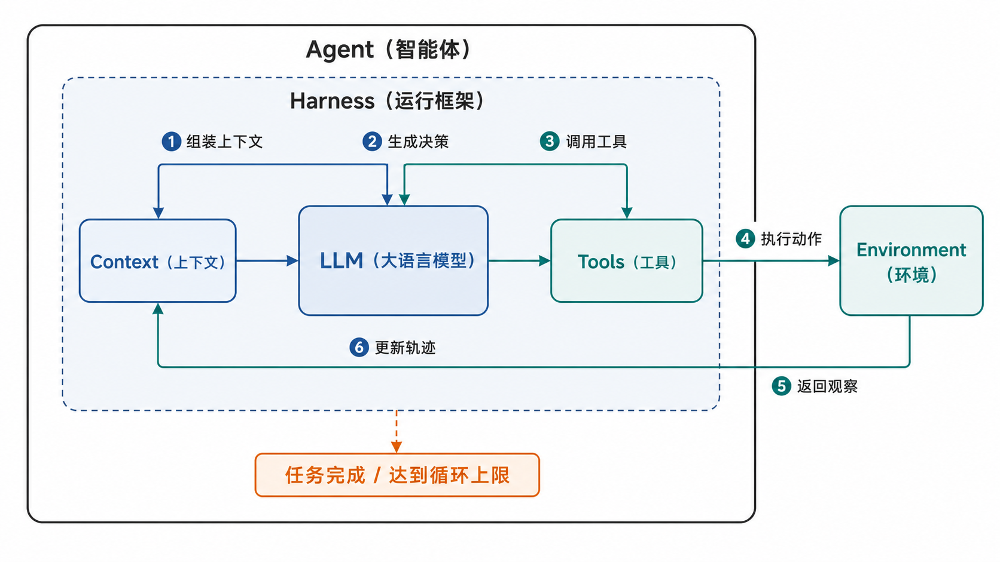

# 组会一对一讨论讲稿：Agent 资源实验与下一步计划

老师好。为了先把 Agent（智能体）搞通，我上两周读了《深入理解 AI Agent（人工智能智能体）》这本书的第一章。这个章节从相对底层的角度介绍了 Agent（智能体）的系统组成和运行过程。我读完以后，先复现了书里的一个上下文消融实验；这周又在原实验上增加了资源观测和计算，完成了 150 次正式运行。接下来我准备沿着这套代码继续扩展，先做一个单机单边缘节点的 MEC（移动边缘计算）实验平台，再根据实测数据构建资源调度问题。

## 一、我对 Agent 系统组成和运行过程的理解

我先结合这张图说明一下我目前对 Agent（智能体）的理解。

最外面的黑色框是 Agent（智能体）的系统边界。Agent（智能体）内部最核心的三部分是 LLM（大语言模型）、Context（上下文）和 Tools（工具）。LLM（大语言模型）负责决定下一步做什么；Context（上下文）是模型当前能够看到的信息，包括系统提示词、用户任务、历史回复和工具返回结果；Tools（工具）是 Agent（智能体）能够调用的动作接口。右侧的 Environment（环境）位于 Agent（智能体）边界之外，真正执行工具动作并返回外部观察。

图中的虚线框是 Harness（运行框架）。它负责把这些组件组织成一个可运行的系统，包括组装上下文、调用模型、校验工具名称和参数、执行工具、保存轨迹、限制循环轮数，以及判断任务是否完成。它也是后续实施资源控制和调度策略的主要位置。

图中的六个编号对应一次完整循环。第一步，运行框架把任务、历史和工具观察组装成上下文；第二步，模型根据上下文生成决策；第三步，模型选择工具并给出调用参数；第四步，工具接口把动作交给环境执行；第五步，环境返回观察；第六步，运行框架把观察加入轨迹，形成下一轮上下文。这个循环一直运行到任务完成或者达到循环上限。

这张图对资源建模的意义是，Agent（智能体）的资源消耗沿着循环逐步产生：每轮上下文产生输入令牌，每次模型调用产生接口费用和推理时延，每次工具调用产生本地计算与环境占用，错误动作还会扩大后续上下文并引起额外循环。因此，资源统计的对象需要覆盖完整任务轨迹。

## 二、我复现和改编的实验

读完这一章后，我先复现了第一章的实验 1-1。原实验给模型四个季度的数据：第一季度是 250 万美元，第二季度是 320 万欧元，第三季度是 180 万英镑，第四季度是 3.8 亿日元。模型需要调用货币转换工具，把后三个季度换算成美元，再调用计算工具得到全年总额和季度平均值。任务明确禁止模型自行估计汇率，最大循环轮数是 5。

这个实验通过五种上下文配置观察不同组件对 Agent（智能体）运行的作用：完整上下文、移除历史、移除历史推理、移除工具定义、移除工具结果。它要回答的问题是：模型缺少某类上下文以后，还能否知道有哪些动作可以执行、记住已经完成了什么、读取环境观察并继续下一步。

原实验已经保存了不少能够用于资源建模的数据，包括每轮真实发送的应用程序接口请求和响应、服务商返回的输入与输出令牌、整个任务的运行时间、循环轮数、工具名称与参数、工具结果与时间戳、重复工具调用、最终答案、是否正常终止、答案是否正确，以及答案中的数字是否来自模型实际见过的工具结果。

这些数据已经构成了一套初步的轨迹资源记录：服务商令牌可以表示模型服务用量，循环轮数和工具调用数可以表示任务工作量，重复调用可以表示无效动作，整体运行时间可以表示端到端时延，正确性和有据性可以作为质量约束。原实验的主要目标是说明上下文组件的作用，因此资源字段的粒度还不足以回答“资源具体消耗在哪一层、每一层如何计算”。例如，原记录无法把每轮输入令牌归属到系统提示词、工具定义、用户消息、历史回复和工具结果，也缺少每次模型调用与工具调用的独立时延、本地计算资源、接口重试和费用计算。

我这周的工作就是把这套行为实验改成可复算的资源实验，主要补了四层数据。

第一层是上下文资源。我使用 Kimi K3 模型对应的分词器，对每轮实际发送的五类上下文分别计数，再和服务商返回的计费令牌同时保存。这样可以分析某类上下文究竟占了多少资源，以及一次无效动作如何增加后面每一轮需要重新读取的上下文。

第二层是模型服务资源。我把模型调用改为流式返回，分别记录请求开始、首个有效生成片段和响应结束时间，同时记录缓存输入、非缓存输入、输出和推理令牌，再根据价格快照计算每个任务的真实接口费用。接口错误、重试次数、状态码和等待时间也进入事件日志，用于识别失败产生的额外资源。

第三层是工具和本地资源。每次工具调用都有开始与结束事件，并记录工具名称、规范化参数、结果、是否重复、墙钟时延、CPU（中央处理器）时间和内存变化。任务级监控还记录整个运行框架及其子进程的 CPU（中央处理器）时间、内存峰值、GPU（图形处理器）时间、显存峰值以及请求和响应字节数。

第四层是任务质量与复算。模型、工具、验证和任务都使用成对的开始与结束事件，原始过程写入 JSONL（逐行结构化日志），再生成任务级和配置级数据表。费用、时延、成功率和成功成本都可以从原始事件重新计算。质量方面仍使用原实验的正确性和有据性判定，避免得到一个资源很低、但任务根本没有正确完成的配置。

正式实验中，五种配置各运行 30 次，共 150 次。完整上下文配置 30 次全部成功，平均累计上下文约 3971 个令牌，平均任务时延约 34.3 秒，平均接口费用约 0.147 元。移除历史和移除工具定义后的成功率都是 0；移除历史推理后的成功率是 93.3%；移除工具结果后的成功率是 3.3%。

这些结果说明，历史和工具结果承担了维持行动闭环的作用，工具定义决定了模型能否正确发现动作接口。历史推理在这个任务中的作用较小，因为下一步操作大多可以从当前任务和工具结果中恢复。上下文缩短也不一定降低总资源：缺少关键观察以后，模型会重复调用、耗尽循环并增加失败成本。

## 三、目前资源是怎样计算的

目前的公式已经写入代码，用于把原始事件聚合成任务级指标，并在验收时重新计算。它们当前承担的是资源测量和结果复核，下一阶段采集到资源竞争数据以后，再把实测参数放入调度优化问题。

第一项是累计上下文资源：

$$
P_r^{\mathrm{cum}}=\sum_{k=1}^{K_r}P_{r,k}
$$

这里的 $r$ 表示第 $r$ 个任务，$K_r$ 表示这个任务一共进行了多少轮模型调用，$P_{r,k}$ 表示第 $k$ 轮实际发送给模型的上下文令牌数。每轮的 $P_{r,k}$ 又由系统提示词、工具定义、用户消息、历史模型回复和工具结果五部分相加得到。最后把每一轮输入相加，得到任务的累计上下文处理量。使用累计量的原因是，前面产生的历史会在后续轮次中被重复读取；只看最后一轮长度会漏掉前几轮已经发生的模型处理。

第二项是 Kimi K3 模型的应用程序接口费用：

$$
C_r=\frac{N_{c,r}p_c+N_{u,r}p_u+N_{o,r}p_o}{10^6}
$$

其中，$N_{c,r}$ 是任务 $r$ 的缓存输入令牌数，$N_{u,r}$ 是非缓存输入令牌数，$N_{o,r}$ 是输出令牌数；$p_c$、$p_u$ 和 $p_o$ 分别是三类令牌每一百万个的价格。三类令牌数量乘以各自单价以后相加，再除以一百万，就得到这个任务实际产生的接口费用。这里使用服务商响应中的令牌量计算费用，本地分词结果用于分析上下文组成，两套计数分别承担计费和结构分析。

第三项是任务端到端时延的分解：

$$
T_r^{\mathrm{task}}=T_r^{\mathrm{model}}+T_r^{\mathrm{tool}}+T_r^{\mathrm{verify}}+T_r^{\mathrm{framework}}
$$

$T_r^{\mathrm{task}}$ 是任务从开始到结束的总墙钟时间；$T_r^{\mathrm{model}}$ 是所有模型请求耗时之和；$T_r^{\mathrm{tool}}$ 是所有工具执行耗时之和；$T_r^{\mathrm{verify}}$ 是答案正确性和有据性验证耗时；$T_r^{\mathrm{framework}}$ 是上下文组装、状态管理、日志和其他运行框架开销。代码直接测量模型、工具和验证时延，再用任务总时延扣除这三项得到运行框架开销，并检查四个分项相加是否回到端到端时延。

本地计算资源使用 CPU（中央处理器）秒、RSS（常驻内存）峰值、GPU（图形处理器）运行时间、显存峰值和传输字节表示。CPU（中央处理器）秒表示进程实际占用处理器的累计时间，RSS（常驻内存）峰值表示任务执行期间的最高驻留内存。当前模型通过远程接口推理，所以本机 GPU（图形处理器）和显存观测都是 0；它只能说明本机没有执行推理，无法表示服务商内部的 GPU（图形处理器）资源。

目前这套资源模型已经跑通了“从轨迹采集数据—按公式计算—结合质量评价—比较不同配置”的完整测量链。它的边界是单任务、单 Agent（智能体）和串行工具执行，还没有多任务并发竞争，也没有工具环境创建、持续驻留和释放的资源记录，因此当前数据主要用于描述和比较，尚未形成有竞争约束的调度优化问题。

## 四、下一步准备怎样扩展

下一步我准备继续在这套代码上做一个单机单边缘节点 MEC（移动边缘计算）实验平台。当前电脑对应一个物理边缘节点，节点内部划分多个受 CPU（中央处理器）、内存和并发槽位约束的逻辑资源池。每个 Agent（智能体）作为独立工作进程运行，多个任务同时到达并共享有限资源，由真实进程并发、资源配额和排队产生可观测的资源竞争。

工具环境生命周期的设计来自之前阅读的 ThunderAgent（雷霆智能体）论文。论文指出，工具资源管理需要处理两个问题：任务结束以后，未释放的沙箱、网络连接和计算槽位会持续占用资源；编码类 Agent（智能体）在运行前还需要启动容器、安装依赖和构建仓库，环境准备时间会随着并发增加。ThunderAgent（雷霆智能体）使用生命周期钩子，在程序终止时立即回收工具资源，并根据等待队列提前异步准备环境。

我准备参考这篇论文的开源代码，把工具环境抽象成“创建中—就绪—执行中—空闲—释放”五个状态。每次状态转换都进入事件日志，分别测量冷启动时间、热复用时间、执行时间、空闲驻留时间、释放时间、CPU（中央处理器）秒、内存峰值和内存占用面积。后续实现会重点参考 ThunderAgent（雷霆智能体）代码中的程序状态记录、生命周期钩子、资源回收和异步环境准备机制，再把它们适配到当前较小的单节点实验平台。

在任务侧，我会保留第一章的多币种任务作为回归基线，再增加多个工具组成的动态任务。多个 Agent（智能体）同时请求相同工具环境后，就会产生排队、环境创建与复用、驻留内存和并发槽位竞争。这样采集到的数据可以估计不同工具的冷启动、热调用、CPU（中央处理器）、内存、驻留和释放参数。

有了这些实测参数以后，调度器需要决定任务何时放行、Agent（智能体）的当前步骤进入哪个逻辑资源池、工具环境是新建还是复用、空闲环境何时释放。调度目标综合考虑端到端时延、Kimi K3 模型接口费用、本地 CPU（中央处理器）与内存占用，以及重复动作、失败和重试产生的浪费资源。调度器在每次获得新的工具观察后重新读取当前轨迹和资源状态，采用滚动时域更新决策，以适应 Agent（智能体）后续步骤无法预先完全确定的特点。

现阶段云端推理仍然用 Kimi K3 模型的令牌、接口费用、请求时延和传输字节表示。本阶段的主要研究对象是 Agent（智能体）动态轨迹、工具环境生命周期和边缘资源竞争之间的关系。通信资源和本地推理后端会在对应文献与设备条件具备以后进入测量链。长期目标是把这些实测的 Agent（智能体）资源参数接入太阳能 serverless computing（无服务器计算）场景，形成面向 Agent（智能体）的云边协同资源调度模型。

## 五、想和老师确认的问题

1. 下一阶段是否认可我先完成“单物理边缘节点、多个逻辑资源池、多个 Agent（智能体）并发、共享工具环境”的测量平台，先获得资源竞争和工具生命周期的实测参数，再构建调度优化问题？
2. 工具环境的创建、复用、驻留和释放是否可以作为下一阶段区别于普通模型卸载的核心调度对象，并以 ThunderAgent（雷霆智能体）的生命周期管理代码作为主要实现参考？
3. 当前阶段是否继续将 Kimi K3 模型的令牌费用和接口时延作为云端推理资源表示，把通信公式和本地推理资源放到后续阶段，再逐步接入太阳能 serverless computing（无服务器计算）场景？

## 相关材料

- Agent（智能体）系统图：`resource_experiment/assets/agent-system-runtime-loop.png`
- 阶段总结与模型计划：`resource_experiment/阶段总结与MEC模型构建计划.md`
- 正式实验报告：`resource_experiment/results/kimi-k3-context-resource-ablation/REPORT.md`
- 实验代码：`resource_experiment/`
- ThunderAgent（雷霆智能体）开源代码：<https://github.com/ThunderAgent-org/ThunderAgent>
